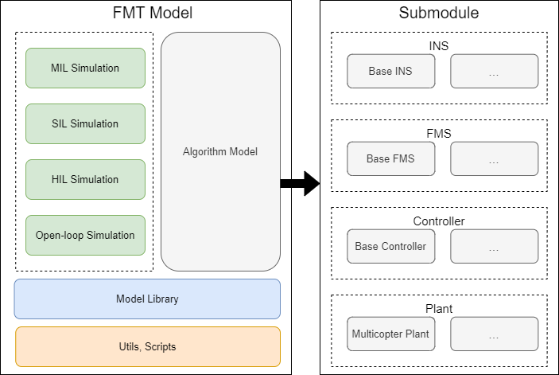
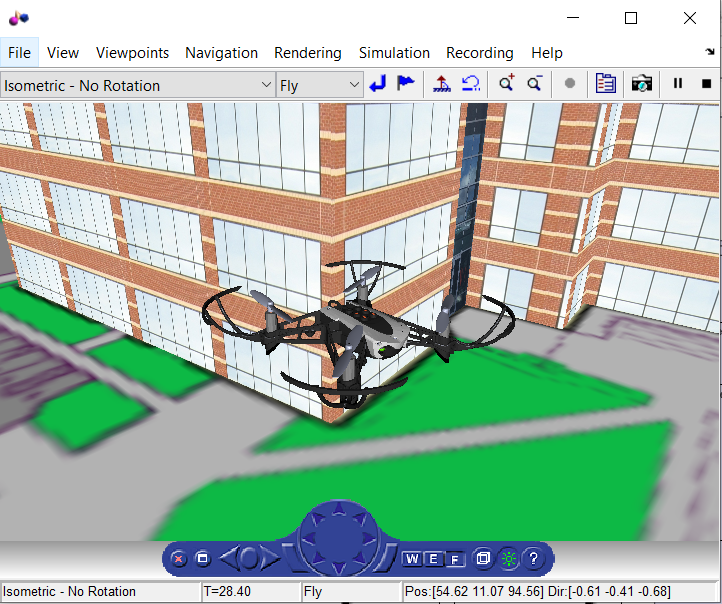
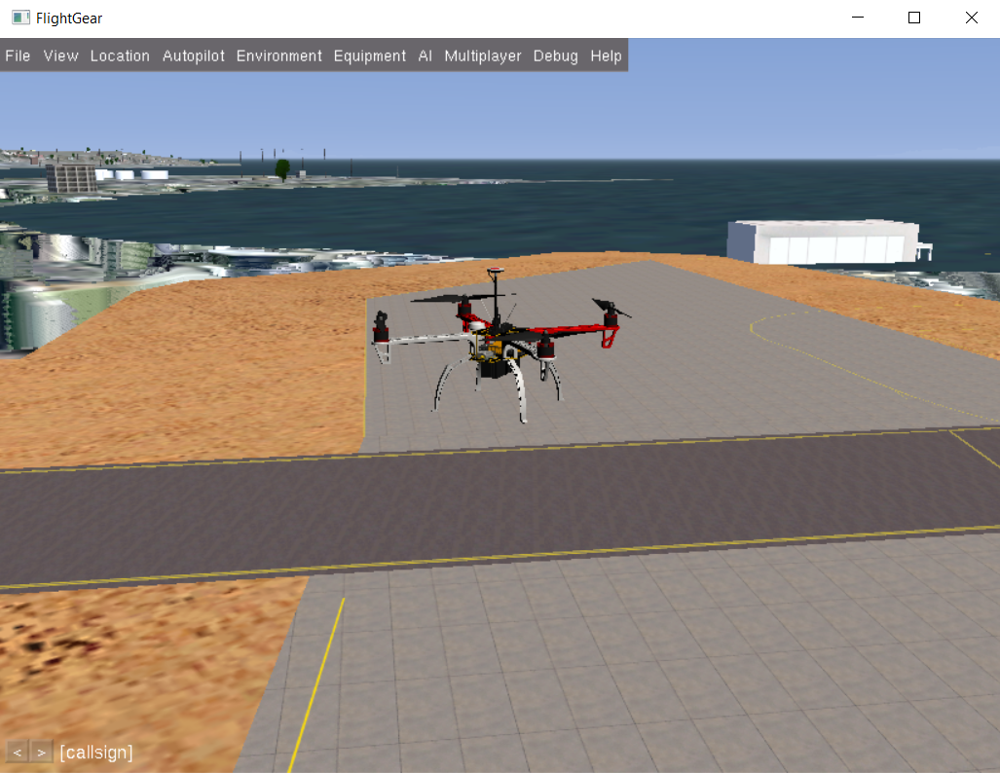

<p align="center"></p>

<p align="center">
  <a href="/LICENSE"></a>
</p>

# Overview
Firmament Model (FMT Model) is a part of [Firmament Autopilot](https://github.com/Firmament-Autopilot) project. It includes a simulation framework with algorithm libraries designed with MATLAB/Simulink.

## Architecture
<p align="center"></p>

## Environmet
FMT-Model is developed in MATLAB 2018b, which is the recommend version. However, you should be able to use higher MATLAB version as well.

## Required Toolbox
- Aerospace Blockset (4.0)
- Embedded Coder (7.1)
- Instrument Control Toolbox (3.14)
- MATLAB (9.5)
- Simulink (9.2)
- Simulink 3D Animation (8.1)
- Simulink Coder (9.0)

For other toolboxes required by the model, please check the *README.md* inside the submodules.

## Document
[User Guide](https://docs.sieon.net/fmt)

## Quick Start
To get the FMT-Model, use the following command. This will clone the code base of FMT-Model with all submodules (INS, FMS, Controller, Plant).

```
git clone https://github.com/Firmament-Autopilot/FMT-Model.git --recursive
```

Then open MATLAB and change the work directory to FMT-Model root folder. After that, run the`FMT_Model.prj`, which will do all the initialization for you.

## Code Catalogue
FMT-Model source code catalog is shown as follow:

| Name       | Description                               |
| ---------- | ----------------------------------------- |
| bus        | Scripts to generate simulink bus objects. |
| figures    | Project figures.                          |
| lib        | FMT-Model toolbox model library.          |
| model      | Simulink model source file.               |
| script     | Matlab scripts.                           |
| simulation | Simulation related simulink model.        |
| utils      | Project utils.                            |

## Simulation

Current supported simulation:
- MIL (Model-in-the-loop Simulation) 
- Open-loop Simulation

For more information, please refer to the document.

<p float="left">
  
  
</p>
